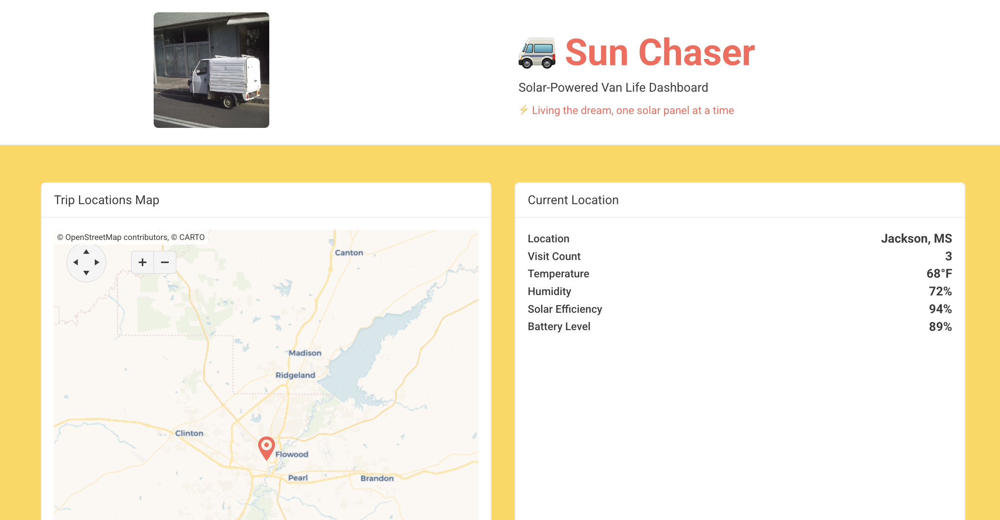

## Sun Chaser

Sun Chaser is a web dashboard created for the [MagnoliaConf Hackathon](https://2025.magnoliaconf.com/), built with React, Vite, and KendoReact. It's the first working version of a larger art-tech project: a van outfitted with a solar-powered webserver and GPS adventure logging.

Core Features
	•	Interactive map showing the van's route and general location (well there is a map)
	•	Live stats on solar output, uptime, and travel metrics (no)
	•	Build details and technical notes on the van and server setup (nah)
	•	Photo gallery and travel log from the road (nope)
	•	Dynamic data grid and charts powered by KendoReact (yep, mostly)
	•	Sensor readings streamed from the onboard system (nope)
	•	Customizable dashboard views and UI experiments (eh)
	•	Reflections on digital nomadism and creative tech (nah)

## 🛠️ Kendo React Components Used

### Layout Components (6)
- `Card` - Main container components
- `CardBody` - Card content areas
- `CardTitle` - Card headings
- `CardHeader` - Card header sections
- `StackLayout` - Responsive layout system
- `ListView` - Data display component

### Chart Components (9)
- `Chart` - Main chart container
- `ChartSeries` - Chart data series
- `ChartSeriesItem` - Individual chart lines/bars
- `ChartCategoryAxis` - X-axis configuration
- `ChartCategoryAxisItem` - X-axis categories
- `ChartValueAxis` - Y-axis configuration
- `ChartValueAxisItem` - Y-axis values
- `ChartTitle` - Chart titles
- `ChartLegend` - Chart legends

### Input Components (2)
- `TextBox` - Form input fields
- `Label` - Form labels

### Button Components (1)
- `Button` - Interactive buttons

### Progress Components (1)
- `ProgressBar` - Solar efficiency visualization

**Total: 19 unique Kendo React components** across 6 different packages
